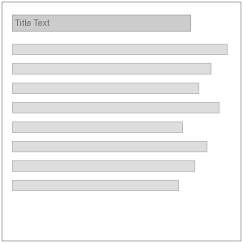

# Orbit Paragraphs Page Sections

This repository provides shared paragraph tooling in the base `orbit_paragraphs` module and ships page section bundles through its submodules.

## Base module

- **Title:** Orbit Paragraphs
- **Description:** Provides common paragraph fields and functionality for Orbit.
- **Provided page sections:** None directly. The base module provides shared fields, admin reporting, and helper functionality used by the submodules below.

## Page sections

| Thumbnail | Title | Description | Built |
| --- | --- | --- | --- |
|  | Text | Text section with optional title. | ✅ |
|  | Inline Image | Inline image with optional title and intro paragraph. | ✅ |
| TBD | Expanding Sections | Expandable/collapsible content sections for progressive disclosure. | ⬜ |
| TBD | 50/50 Image Text | Two-column section with balanced image and text content. | ⬜ |
| TBD | File Download | Download section for files with title, description, and file link. | ⬜ |
| TBD | Video | Video section for embedded or uploaded media with optional supporting copy. | ⬜ |
| TBD | Full width Image | Simple full width image. | ⬜ |
| TBD | Full width Image and text | Simple full width image with title, text and link. | ⬜ |
