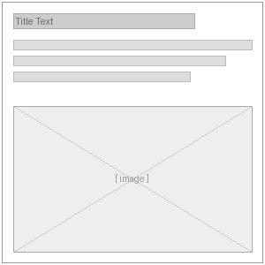

# Orbit Paragraphs Page Sections

This repository provides shared paragraph tooling in the base `orbit_paragraphs` module and ships page section bundles through its submodules.

## Base module

- **Title:** Orbit Paragraphs
- **Description:** Provides common paragraph fields and functionality for Orbit.
- **Provided page sections:** None directly. The base module provides shared fields, admin reporting, and helper functionality used by the submodules below.

## Provided page sections

| Thumbnail | Title | Description |
| --- | --- | --- |
|  | Text | Text section with optional title. |
|  | Inline Image | Inline image with optional title and intro paragraph. |
